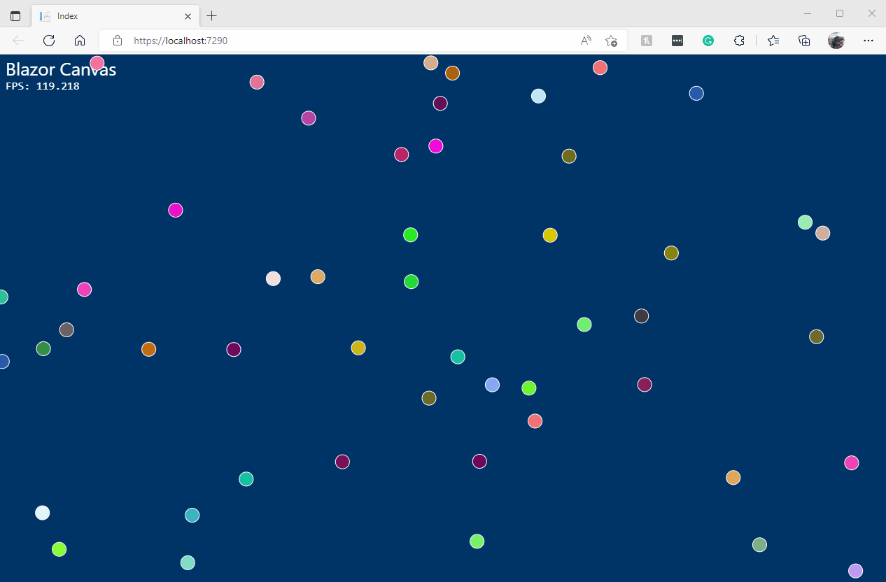

# Blazor Canvas

This demo builds on from Scott Harden's EXCELLENT blog post, [Draw Animated Graphics in the Browser with Blazor WebAssembly](https://swharden.com/blog/2021-01-07-blazor-canvas-animated-graphics/), which uses the OSS [Blazor.Extensions.Canvas](https://github.com/BlazorExtensions/Canvas) component to draw on the canvas, but also includes JavaScript to help with animations, illustrating the real power of the HTML Canvas element. 

I took it one step beyond by encapsulating the JavaScript required to do animations in a Razor Class Library, which I call `AvnCanvasHelper`. At some point, I will create a repo just for `AvnCanvasHelper` because it can be used to do any kind of Canvas animation.

## AvnCanvasHelper

To use `AvnCanvasHelper`, place the `BECanvas` inside it as child content like so:

```c#
<CanvasHelper 
    @ref="CanvasHelper"
    CanvasResized="CanvasResized" 
    RenderFrame="RenderFrame"
    MouseDown="MouseDown"
    MouseUp="MouseUp"
    MouseMove="MouseMove">

        <BECanvas Width="600" Height="400" @ref="CanvasReference"></BECanvas>

</CanvasHelper>
```

Then, you'll need to hold references to the `AvnCanvasHelper` as well as the Context and the Canvas itself:

```c#
private Canvas2DContext Ctx;
private BECanvasComponent CanvasReference;
private CanvasHelper CanvasHelper;
```

Create your canvas reference in `OnAfterRenderAsync` and initialize the `AvnCanvasHelper`

```c#
protected override async Task OnAfterRenderAsync(bool firstRender)
{
    if (firstRender)
    {
        // Create the canvas and context
        Ctx = await CanvasReference.CreateCanvas2DAsync();
        // Initialize the helper
        await CanvasHelper.Initialize();
    }
}
```

Now you can handle the `RenderFrame` event to draw the next frame. Here's an example from the demo:

```c#
public async Task RenderFrame(double fps)
{
    // update the Frames Per Second measurement
    FPS = fps;

    // The following code is adapted from Scott Harden's EXCELLENT blog post, 
    // "Draw Animated Graphics in the Browser with Blazor WebAssembly"
    // https://swharden.com/blog/2021-01-07-blazor-canvas-animated-graphics/

    if (BallField.Balls.Count == 0)
        BallField.AddRandomBalls(50);

    BallField.StepForward();

    await this.Ctx.BeginBatchAsync();

    await this.Ctx.ClearRectAsync(0, 0, BallField.Width, BallField.Height);
    await this.Ctx.SetFillStyleAsync("#003366");
    await this.Ctx.FillRectAsync(0, 0, BallField.Width, BallField.Height);

    await this.Ctx.SetFontAsync("26px Segoe UI");
    await this.Ctx.SetFillStyleAsync("#FFFFFF");
    await this.Ctx.FillTextAsync("Blazor Canvas", 10, 30);

    await this.Ctx.SetFontAsync("16px consolas");
    await this.Ctx.FillTextAsync($"FPS: {fps:0.000}", 10, 50);

    await this.Ctx.SetStrokeStyleAsync("#FFFFFF");
    foreach (var ball in BallField.Balls)
    {
        await this.Ctx.BeginPathAsync();
        await this.Ctx.ArcAsync(ball.X, ball.Y, ball.R, 0, 2 * Math.PI, false);
        await this.Ctx.SetFillStyleAsync(ball.Color);
        await this.Ctx.FillAsync();
        await this.Ctx.StrokeAsync();
    }

    await this.Ctx.EndBatchAsync();
}
```

### Methods

`AvnCanvasHelper` exposes the following methods;

| Method     | Description                                                  |
| ---------- | ------------------------------------------------------------ |
| Initialize | Call this in your Blazor app's OnAfterRenderAsync method when firstRender is true |

### Events

`AvnCanvasHelper` exposes the following events:

| Event         | Description                                            |
| ------------- | ------------------------------------------------------ |
| CanvasResized | When the browser, and therefore the canvas, is resized |
| RenderFrame   | When a frame is ready to be drawn                      |
| MouseDown     | The user clicked a mouse button                        |
| MouseUp       | The user released a mouse button                       |
| MouseMove     | The user moved the mouse                               |

### CanvasMouseArgs

The DOM holds a lot of information for the mouse. I've extracted the basic properties into `CanvasMouseArgs` which is passed into the `MouseDown`, `MouseUp`, and `MouseMove` events. For more information check out [https://developer.mozilla.org/en-US/docs/Web/API/MouseEvent](https://developer.mozilla.org/en-US/docs/Web/API/MouseEvent)

```c#
public class CanvasMouseArgs
{
    public int ScreenX { get; set; }
    public int ScreenY { get; set; }
    public int ClientX { get; set; }
    public int ClientY { get; set; }
    public int MovementX { get; set; }
    public int MovementY { get; set; }
    public int OffsetX { get; set; }
    public int OffsetY { get; set; }
    public bool AltKey { get; set; }
    public bool CtrlKey { get; set; }
    public bool Bubbles { get; set; }
    public int Buttons { get; set; }
    public int Button { get; set; }
}
```

## BlazorCanvas Demo

The demo is a Blazor Server application that replicates the code Scott Harden's EXCELLENT blog post, [Draw Animated Graphics in the Browser with Blazor WebAssembly](https://swharden.com/blog/2021-01-07-blazor-canvas-animated-graphics/), which uses the OSS [Blazor.Extensions.Canvas](https://github.com/BlazorExtensions/Canvas) component to draw on the canvas, but using a helper component so we never have to touch JavaScript.

Here are the steps to reproduce the demo:

**Download or clone this repo.**

**Create a Blazor Server App in Visual Studio called BlazorCanvas**

**Add the AvnCanvasHelper project to the solution.**

It would be helpful to first copy the `AvnCanvasHelper` folder into the solution folder before adding it.

**Add a project reference from BlazorCanvas to AvnCanvasHelper** 

The rest of the steps are all in the `BlazorCanvas` project.

Add the following to the .csproj file:

```xml
<ItemGroup>
    <PackageReference Include="Blazor.Extensions.Canvas" Version="1.1.1" />
</ItemGroup>
```

**Add the following to *Pages/_Layout.cshtml*** below the line `<script src="_framework/blazor.server.js"></script>`

```html
<script src="_content/Blazor.Extensions.Canvas/blazor.extensions.canvas.js"></script>
```

**Add the following to *_Imports.razor*** :

```c#
@using Blazor.Extensions
@using Blazor.Extensions.Canvas
@using Blazor.Extensions.Canvas.Canvas2D
@using Blazor.Extensions.Canvas.WebGL
@using AvnCanvasHelper
@using System.Drawing
```

**Replace Shared/MainLayout.razor with the following:**

```
@inherits LayoutComponentBase
@Body
```

**Add a *Models* folder and add these two classes:**

*Ball.cs*:

```c#
/*
 * Adapted from Scott Harden's EXCELLENT blog post, 
 * "Draw Animated Graphics in the Browser with Blazor WebAssembly"
 * https://swharden.com/blog/2021-01-07-blazor-canvas-animated-graphics/
 */
public class Ball
{
    public double X { get; private set; }
    public double Y { get; private set; }
    public double XVel { get; private set; }
    public double YVel { get; private set; }
    public double R { get; private set; }
    public string Color { get; private set; }

    public Ball(double x, double y, double xVel, double yVel, 
                double radius, string color)
    {
        (X, Y, XVel, YVel, R, Color) = (x, y, xVel, yVel, radius, color);
    }

    public void StepForward(double width, double height)
    {
        X += XVel;
        Y += YVel;
        if (X < 0 || X > width)
            XVel *= -1;
        if (Y < 0 || Y > height)
            YVel *= -1;

        if (X < 0)
            X += 0 - X;
        else if (X > width)
            X -= X - width;

        if (Y < 0)
            Y += 0 - Y;
        if (Y > height)
            Y -= Y - height;
    }
}
```

*Field.cs*:

```c#
/*
 * Adapted from Scott Harden's EXCELLENT blog post, 
 * "Draw Animated Graphics in the Browser with Blazor WebAssembly"
 * https://swharden.com/blog/2021-01-07-blazor-canvas-animated-graphics/
 */
public class Field
{
    public readonly List<Ball> Balls = new List<Ball>();
    public double Width { get; private set; }
    public double Height { get; private set; }

    public void Resize(double width, double height) =>
        (Width, Height) = (width, height);

    public void StepForward()
    {
        foreach (Ball ball in Balls)
            ball.StepForward(Width, Height);
    }

    private double RandomVelocity(Random rand, double min, double max)
    {
        double v = min + (max - min) * rand.NextDouble();
        if (rand.NextDouble() > .5)
            v *= -1;
        return v;
    }

    public void AddRandomBalls(int count = 10)
    {
        double minSpeed = .5;
        double maxSpeed = 5;
        double radius = 10;
        Random rand = new Random();

        for (int i = 0; i < count; i++)
        {
            Balls.Add(
                new Ball(
                    x: Width * rand.NextDouble(),
                    y: Height * rand.NextDouble(),
                    xVel: RandomVelocity(rand, minSpeed, maxSpeed),
                    yVel: RandomVelocity(rand, minSpeed, maxSpeed),
                    radius: radius,
                    color: string.Format("#{0:X6}", rand.Next(0xFFFFFF))
                )
            );
        }
    }
}
```

**Replace *Pages/Index.razor* with the following**:

```c#
@page "/"

<PageTitle>Index</PageTitle>

<CanvasHelper 
    @ref="CanvasHelper"
    CanvasResized="CanvasResized" 
    RenderFrame="RenderFrame"
    MouseDown="MouseDown"
    MouseUp="MouseUp"
    MouseMove="MouseMove">

        <BECanvas Width="600" Height="400" @ref="CanvasReference"></BECanvas>

</CanvasHelper>

@code {

    private Size Size = new Size();
    private double FPS;
    private Canvas2DContext Ctx;
    private BECanvasComponent CanvasReference;
    private CanvasHelper CanvasHelper;
    private Field BallField = new Field();

    protected override async Task OnAfterRenderAsync(bool firstRender)
    {
        if (firstRender)
        {
            // Create the canvas and context
            Ctx = await CanvasReference.CreateCanvas2DAsync();
            // Initialize the helper
            await CanvasHelper.Initialize();
        }
    }

    /// <summary>
    /// Called by CanvasHelper whenever we are ready to render a frame
    /// </summary>
    /// <param name="fps"></param>
    /// <returns></returns>
    public async Task RenderFrame(double fps)
    {
        // update the Frames Per Second measurement
        FPS = fps;

        // The following code is adapted from Scott Harden's EXCELLENT blog post, 
        // "Draw Animated Graphics in the Browser with Blazor WebAssembly"
        // https://swharden.com/blog/2021-01-07-blazor-canvas-animated-graphics/

        if (BallField.Balls.Count == 0)
            BallField.AddRandomBalls(50);

        BallField.StepForward();

        await this.Ctx.BeginBatchAsync();

        await this.Ctx.ClearRectAsync(0, 0, BallField.Width, BallField.Height);
        await this.Ctx.SetFillStyleAsync("#003366");
        await this.Ctx.FillRectAsync(0, 0, BallField.Width, BallField.Height);

        await this.Ctx.SetFontAsync("26px Segoe UI");
        await this.Ctx.SetFillStyleAsync("#FFFFFF");
        await this.Ctx.FillTextAsync("Blazor Canvas", 10, 30);

        await this.Ctx.SetFontAsync("16px consolas");
        await this.Ctx.FillTextAsync($"FPS: {fps:0.000}", 10, 50);

        await this.Ctx.SetStrokeStyleAsync("#FFFFFF");
        foreach (var ball in BallField.Balls)
        {
            await this.Ctx.BeginPathAsync();
            await this.Ctx.ArcAsync(ball.X, ball.Y, ball.R, 0, 2 * Math.PI, false);
            await this.Ctx.SetFillStyleAsync(ball.Color);
            await this.Ctx.FillAsync();
            await this.Ctx.StrokeAsync();
        }

        await this.Ctx.EndBatchAsync();
    }

    /// <summary>
    /// Called by CanvasHelper whenever the browser is resized.
    /// </summary>
    /// <param name="size"></param>
    public void CanvasResized(Size size)
    {
        Size = size;
        BallField.Resize(size.Width, size.Height);
    }
    
    // Handle mouse down events
    void MouseDown(CanvasMouseArgs args)
    {
        
    }

    // Handle mouse up events
    void MouseUp(CanvasMouseArgs args)
    {
        
    }

    // Handle mouse move events
    void MouseMove(CanvasMouseArgs args)
    {
        
    }
}
```

Run the app!

